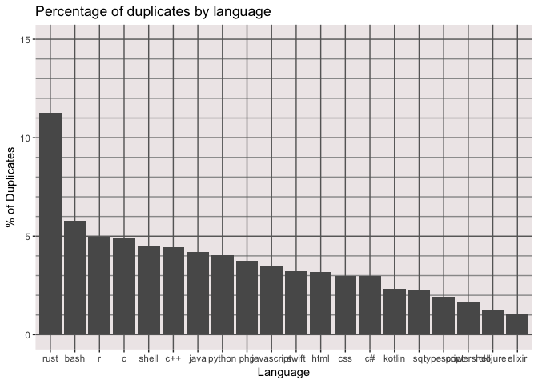

Exploratory Data Analysis
================
[Jim Tyhurst](https://www.jimtyhurst.com/)
2019-04-28

  - [Package dependencies](#package-dependencies)
  - [Data source](#data-source)
      - [Attribution of data](#attribution-of-data)
      - [Schema](#schema)
      - [SQL access to Stack Exchange
        data](#sql-access-to-stack-exchange-data)
      - [Other sources of Stack Exchange data are
        available](#other-sources-of-stack-exchange-data-are-available)
  - [Data preparation](#data-preparation)
      - [Duplicate question counts](#duplicate-question-counts)
      - [Duplicate question content](#duplicate-question-content)
  - [Exploratory analysis of
    duplicates](#exploratory-analysis-of-duplicates)
      - [Percentage of duplicates by
        language](#percentage-of-duplicates-by-language)

🔻 *Work in Process* … 🔺

Source code at: [EDA.Rmd](../vignettes/EDA.Rmd)

## Package dependencies

``` r
library(stackR)
library(readr)
library(forcats)
library(dplyr)
library(ggplot2)
library(lubridate)
```

## Data source

### Attribution of data

Data was obtained from
[StackExchange](https://data.stackexchange.com/help). They license their
data with the [Creative Commons
Attribution-ShareAlike](https://creativecommons.org/licenses/by-sa/3.0/)
license.

See Stack Overflow’s blog post, “[Attribution
Required](https://stackoverflow.blog/2009/06/25/attribution-required/)”.

### Schema

  - [Stack Exchange Data Explorer Schema
    ERD](https://sedeschema.github.io/): [reverse engineered from
    information\_schema.columns using a Python script and
    DbSchema](https://github.com/leerssej/SEDESchema)
  - [Database schema documentation for the public data dump and
    SEDE](https://meta.stackexchange.com/questions/2677/database-schema-documentation-for-the-public-data-dump-and-sede/2678)

### SQL access to Stack Exchange data

[Stack Exchange Data Explorer](https://data.stackexchange.com/help) is
an online tool for accessing Stack Exchange data. I used this tool to
count posts having certain characteristics and to download posts
satisfying certain conditions.

### Other sources of Stack Exchange data are available

I explored these data sources briefly, but did not use them for this
analysis.

#### Zipped data files

Rather than trying to install these large files on my local machine, I
decided to run SQL queries against the original data using the [Stack
Exchange Data Explorer](https://data.stackexchange.com/help) and then
download subsets of data for processing locally.

  - [Files for
    stackexchange](https://archive.org/download/stackexchange/)
  - [Documentation of the CSV
    files](https://ia800107.us.archive.org/27/items/stackexchange/readme.txt)

For example, as of 2019-04-07 there are 7 CSV files for posts in Stack
Overflow:

| Name                             | Last modified     | Size   |
| -------------------------------- | ----------------- | ------ |
| stackoverflow.com-Badges.7z      | 04-Mar-2019 14:04 | 218.8M |
| stackoverflow.com-Comments.7z    | 04-Mar-2019 14:25 | 3.9G   |
| stackoverflow.com-PostHistory.7z | 04-Mar-2019 15:26 | 23.0G  |
| stackoverflow.com-PostLinks.7z   | 04-Mar-2019 15:27 | 76.8M  |
| stackoverflow.com-Posts.7z       | 04-Mar-2019 16:32 | 13.2G  |
| stackoverflow.com-Tags.7z        | 04-Mar-2019 16:32 | 768.9K |
| stackoverflow.com-Users.7z       | 04-Mar-2019 16:33 | 431.4M |
| stackoverflow.com-Votes.7z       | 04-Mar-2019 16:38 | 997.3M |

#### Google BigQuery

This extract of the Stack Exchange data only covers 2008-07-31 to
2016-06-12, whereas the data available through the [Stack Exchange Data
Explorer](https://data.stackexchange.com/help) covers 2008-07-31 to
2019-04-07. So I decided not to use Google BigQuery, since the data does
not cover recent years.

  - Blog post: “[Google BigQuery public datasets now include Stack
    Overflow
    Q\&A](https://cloud.google.com/blog/products/gcp/google-bigquery-public-datasets-now-include-stack-overflow-q-a)”
  - Compose Query:
    [bigquery-public-data:stackoverflow](https://bigquery.cloud.google.com/dataset/bigquery-public-data:stackoverflow?pli=1)

Note that the [Google BigQuery table
structure](https://bigquery.cloud.google.com/dataset/bigquery-public-data:stackoverflow?pli=1)
is slightly *different* than the [schema used by Stack
Exchange](https://sedeschema.github.io/). For example, the field names
in Google BigQuery follow a snake-case naming convention
(post\_history\_type\_id), whereas the Stack Exchange database uses
camel-case (PostHistoryTypeId).

\*\* Sample Query \*\*

``` sql
-- Google BigQuery
-- Counts the number of Posts closed as a duplicate.
SELECT COUNT(DISTINCT d.id) AS n_closed_duplicate_questions
FROM [bigquery-public-data:stackoverflow.posts_questions] d  -- d=duplicate
LEFT JOIN [bigquery-public-data:stackoverflow.post_history] ph ON ph.post_id = d.id
LEFT JOIN [bigquery-public-data:stackoverflow.post_links] pl ON pl.post_id = d.id
LEFT JOIN [bigquery-public-data:stackoverflow.posts_questions] o ON o.id = pl.related_post_id  -- o=original
WHERE
  d.post_type_id = 1  -- 1=Question
  AND pl.link_type_id = 3  -- 3=duplicate
  AND ph.post_history_type_id = 10  -- 10=Post Closed
```

## Data preparation

### Duplicate question counts

I used two queries to count total questions and duplicate questions for
20 of the [25 most popular programming
languages](https://insights.stackoverflow.com/survey/2019#technology-_-programming-scripting-and-markup-languages):

``` sql
-- Counts total number of question posts with a given language tag.
SELECT
  COUNT(DISTINCT(op.Id))
FROM posts op 
WHERE
  op.posttypeid = 1            -- Question post
  AND op.Tags like '%<java>%'  -- Language tag
```

``` sql
-- Counts number of question posts marked as a duplicate for a given language tag.
SELECT COUNT(DISTINCT dp.id)
FROM posts dp
  JOIN postlinks pl ON dp.id = pl.postid
WHERE
  dp.posttypeid = 1 -- Question post
  AND pl.linktypeid = 3 -- duplicate
  AND dp.tags like '%<java>%';
```

The resulting table of data is available as a CSV file,
`duplicates-totals-pct.csv`
([download](../inst/extdata/duplicates-totals-pct.csv)).

### Duplicate question content

The [following
query](https://data.stackexchange.com/stackoverflow/query/1029995/duplicate-pairs-of-questions-related-to-a-tag?PageSize=25&PageNumber=1&Tags=%27%25%3Cpython%3E%25%27)
was used to obtain data for duplicate posts. When you run the query in
the [Stack Exchange Data Explorer](https://data.stackexchange.com/help),
it prompts for 3 parameter values:

  - PageSize : Number of rows to return. 50,000 seems to be the maximum
    that will be returned from any one query.
  - Page Number : Enables you to download a large dataset by retrieving
    one page at a time. For example, use `1` for the first “page”,
    i.e. subset of data, `2` for the second page, etc.
  - Tags : A string to match the `posts.tags` field. For example,
    `'%<python>%'` will match an instance of the `tags` field that
    contains the `<python>` tag. Note: tags all seem to be lower case
    and surrounded by `<` … `>`.

<!-- end list -->

``` sql
-- Duplicate pairs of questions related to a tag.
-- Derived from Jordan Witte's query:
--   https://data.stackexchange.com/stackoverflow/query/1029675/duplicate-pairs
--   https://github.com/Eric-D-Stevens/Data_Science_Meetup_April/blob/master/sql/basic_fetch_duplicate_pairs.sql

DECLARE @PageSize int = ##PageSize##
DECLARE @PageNumber int = ##PageNumber##
DECLARE @Tags nvarchar = ##Tags##

SELECT 
  op.Id OriginalPostId , 
  op.PostTypeId OriginalPostPostTypeId , 
  op.AcceptedAnswerId OriginalPostAcceptedAnswerId , 
  op.ParentId OriginalPostParentId , 
  op.CreationDate OriginalPostCreationDate , 
  op.DeletionDate OriginalPostDeletionDate , 
  op.Score OriginalPostScore , 
  op.ViewCount OriginalPostViewCount , 
  op.Body OriginalPostBody , 
  op.OwnerUserId OriginalPostOwnerUserId , 
  op.OwnerDisplayName OriginalPostOwnerDisplayName , 
  op.LastEditorUserId OriginalPostLastEditorUserId , 
  op.LastEditorDisplayName OriginalPostLastEditorDisplayName , 
  op.LastEditDate OriginalPostLastEditDate , 
  op.LastActivityDate OriginalPostLastActivityDate , 
  op.Title OriginalPostTitle , 
  op.Tags OriginalPostTags , 
  op.AnswerCount OriginalPostAnswerCount , 
  op.CommentCount OriginalPostCommentCount , 
  op.FavoriteCount OriginalPostFavoriteCount , 
  op.ClosedDate OriginalPostClosedDate , 
  op.CommunityOwnedDate OriginalPostCommunityOwnedDate , 

  dupl.Id DuplicatePostId , 
  dupl.PostTypeId DuplicatePostPostTypeId , 
  dupl.AcceptedAnswerId DuplicatePostAcceptedAnswerId , 
  dupl.ParentId DuplicatePostParentId , 
  dupl.CreationDate DuplicatePostCreationDate , 
  dupl.DeletionDate DuplicatePostDeletionDate , 
  dupl.Score DuplicatePostScore , 
  dupl.ViewCount DuplicatePostViewCount , 
  dupl.Body DuplicatePostBody , 
  dupl.OwnerUserId DuplicatePostOwnerUserId , 
  dupl.OwnerDisplayName DuplicatePostOwnerDisplayName , 
  dupl.LastEditorUserId DuplicatePostLastEditorUserId , 
  dupl.LastEditorDisplayName DuplicatePostLastEditorDisplayName , 
  dupl.LastEditDate DuplicatePostLastEditDate , 
  dupl.LastActivityDate DuplicatePostLastActivityDate , 
  dupl.Title DuplicatePostTitle , 
  dupl.Tags DuplicatePostTags , 
  dupl.AnswerCount DuplicatePostAnswerCount , 
  dupl.CommentCount DuplicatePostCommentCount , 
  dupl.FavoriteCount DuplicatePostFavoriteCount , 
  dupl.ClosedDate DuplicatePostClosedDate , 
  dupl.CommunityOwnedDate DuplicatePostCommunityOwnedDate
FROM posts op 
  JOIN postlinks pl ON op.id = pl.relatedpostid
  JOIN posts dupl ON pl.postid = dupl.id
WHERE
  op.posttypeid = 1      -- Question post
  AND pl.linktypeid = 3  -- duplicate
  AND dupl.tags like @Tags  -- e.g. '%<python>%' for "contains python"
ORDER BY op.Id 
  OFFSET @PageSize * (@PageNumber - 1) ROWS
  FETCH NEXT @PageSize ROWS ONLY;
```

I used this query to download duplicates for 6 of the [25 most popular
programming
languages](https://insights.stackoverflow.com/survey/2019#technology-_-programming-scripting-and-markup-languages),
choosing languages from the most popular (JavaScript) to language near
the bottom of the list (R and Clojure):

  - C\#
  - Clojure
  - Java
  - JavaScript
  - Python
  - R

## Exploratory analysis of duplicates

### Percentage of duplicates by language

``` r
raw_pcts <- system.file(
    "extdata", 
    "duplicates-totals-pct.csv", 
    package = "stackR"
  ) %>% 
  readr::read_csv() %>% 
  dplyr::mutate(pct_duplicates = (duplicate_posts / total_posts) * 100.0) %>% 
  dplyr::arrange(desc(pct_duplicates))
#> Parsed with column specification:
#> cols(
#>   language = col_character(),
#>   total_posts = col_double(),
#>   duplicate_posts = col_double()
#> )
kable(raw_pcts, digits = 2)
```

| language   | total\_posts | duplicate\_posts | pct\_duplicates |
| :--------- | -----------: | ---------------: | --------------: |
| rust       |        11813 |             1333 |           11.28 |
| bash       |       110927 |             6395 |            5.77 |
| r          |       285818 |            14234 |            4.98 |
| c          |       301484 |            14758 |            4.90 |
| shell      |        69923 |             3126 |            4.47 |
| c++        |       614289 |            27237 |            4.43 |
| java       |      1538549 |            64845 |            4.21 |
| python     |      1153996 |            46415 |            4.02 |
| php        |      1277793 |            48112 |            3.77 |
| javascript |      1796439 |            62295 |            3.47 |
| swift      |       227614 |             7381 |            3.24 |
| html       |       817665 |            25873 |            3.16 |
| css        |       582623 |            17404 |            2.99 |
| c\#        |      1304340 |            38646 |            2.96 |
| kotlin     |        22023 |              510 |            2.32 |
| sql        |       488290 |            11227 |            2.30 |
| typescript |        79466 |             1519 |            1.91 |
| powershell |        67326 |             1138 |            1.69 |
| clojure    |        15457 |              194 |            1.26 |
| elixir     |         6814 |               69 |            1.01 |

``` r
# Need to sort the language factor by the percentage before plotting.
sorted_pcts <- raw_pcts %>% 
  dplyr::mutate(
    sorted_language = forcats::fct_reorder(
      language, 
      pct_duplicates, 
      .desc = TRUE
    )
  )
  
sorted_pcts %>%
  ggplot(aes(x = sorted_language, y = pct_duplicates)) +
    geom_col() +
  scale_y_continuous(
    limits = c(0, 15), 
    minor_breaks = seq(0, 15, by = 1),
    breaks = seq(0, 15, by = 5),
  ) + 
  theme(
      panel.grid.minor = element_line(color="grey60", size=0.5),
      panel.grid.major = element_line(color="grey40", size=0.5),
      panel.background = element_rect(fill="snow2")
    ) +
    labs(
      title = "Percentage of duplicates by language", 
      x = "Language", 
      y = "% of Duplicates"
    )
```

<!-- -->

🔻 *Work in Process* … I am still analyzing this data. 🔺
